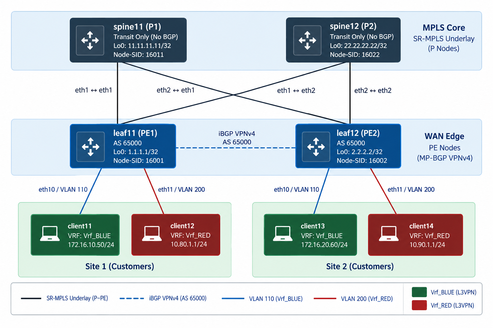

# SONiC WAN Edge — IS-IS, SR-MPLS, and MPLS L3VPN

This bundle lab is a four-node SONiC topology with routed WAN edge design using:

- IS-IS Level 2 as the routed underlay
- Segment Routing over MPLS as the transport
- MP-BGP VPNv4 between the Provider Edge routers
- MPLS L3VPN services using separate customer VRFs

---
## 🚀 WAN Topology Design

  

## Node and Interface Information

Your next Markdown content goes here.
## IS-IS and SR-MPLS Transport

All four routers belong to one IS-IS Level 2 domain.

| Parameter | Value |
|---|---|
| IS-IS process | <code>CORE</code> |
| IS-IS area | <code>49.0001</code> |
| IS type | Level 2 only |
| Metric style | Wide |
| Core link type | Point-to-point |
| SRGB | <code>16000-23999</code> |
| Node MSD | <code>8</code> |

Each router advertises its <code>Loopback0</code> prefix with a Prefix-SID. With
the common SRGB:

~~~text
Label = SRGB lower bound + Prefix-SID index

PE1: 16000 + 1  = 16001
P1:  16000 + 11 = 16011
~~~

No LDP or RSVP-TE configuration is required.

---

## MPLS L3VPN Services

### BLUE VPN

| Item | PE1 / leaf11 | PE2 / leaf12 |
|---|---|---|
| VRF | <code>Vrf_BLUE</code> | <code>Vrf_BLUE</code> |
| Route distinguisher | <code>1.1.1.1:110</code> | <code>2.2.2.2:110</code> |
| Route target | <code>65000:110</code> | <code>65000:110</code> |
| Customer SVI | <code>Vlan110</code> | <code>Vlan110</code> |
| PE gateway | <code>172.16.10.254/24</code> | <code>172.16.20.254/24</code> |
| Access port | <code>Ethernet36</code> | <code>Ethernet36</code> |
| Client | <code>client11</code> | <code>client13</code> |

### RED VPN

| Item | PE1 / leaf11 | PE2 / leaf12 |
|---|---|---|
| VRF | <code>Vrf_RED</code> | <code>Vrf_RED</code> |
| Route distinguisher | <code>1.1.1.1:200</code> | <code>2.2.2.2:200</code> |
| Route target | <code>65000:200</code> | <code>65000:200</code> |
| Customer SVI | <code>Vlan200</code> | <code>Vlan200</code> |
| PE gateway | <code>10.80.1.254/24</code> | <code>10.90.1.254/24</code> |
| Access port | <code>Ethernet40</code> | <code>Ethernet40</code> |
| Client | <code>client12</code> | <code>client14</code> |

The former stretched Layer 2 service is now a routed L3VPN. The BLUE sites must
therefore use different subnets:

~~~text
PE1 BLUE site: 172.16.10.0/24
PE2 BLUE site: 172.16.20.0/24
~~~

---

## MP-BGP VPNv4

PE1 and PE2 form one iBGP VPNv4 session using ASN <code>65000</code>.

| PE | Local address | VPNv4 neighbor |
|---|---:|---:|
| PE1 | <code>1.1.1.1</code> | <code>2.2.2.2</code> |
| PE2 | <code>2.2.2.2</code> | <code>1.1.1.1</code> |

IS-IS provides BGP next-hop reachability. SR-MPLS supplies the transport label,
and FRR allocates the VPN label with:

~~~text
label vpn export auto
~~~

The intended PE data path uses a two-label stack:

~~~text
+----------------------+-------------------+------------------+
| SR transport label   | MPLS VPN label    | Customer packet  |
+----------------------+-------------------+------------------+
~~~

---

## SONiC and FRR Configuration Ownership

The lab retains the source repository's <code>split-unified</code> model.

| SONiC config_db.json | FRR frr.conf |
|---|---|
| Physical interfaces and IP addresses | IS-IS Level 2 |
| Loopback interfaces | IS-IS interface activation |
| VRF creation | SR-MPLS, SRGB, and Prefix-SIDs |
| VLANs and VLAN interfaces | MP-BGP VPNv4 |
| Customer access ports | RDs, route targets, and VPN labels |

It preserves platform-specific tables such as <code>PORT</code>,
<code>FEATURE</code>, <code>LOGGER</code>, and <code>CRM</code>.

> **Why a generator is provided**
>
> The source config_db.json files contain extensive platform-specific data. A
> small replacement file could remove tables required by SONiC VS. The
> generator preserves that data and produces complete per-node configurations,
> not JSON fragments.

---

## Build the WAN Edge Configurations

Clone the source repository:

~~~bash
git clone https://github.com/skyglid3r/sonic-isis-srmpls.git
~~~

Deploy lab in ContainerLab:

~~~bash
clab deploy -t sonic-isis-mpls.yaml
~~~

After the all SONiC nodes on up and Healthy state(typically takes about 3-5 minutes)

Run the deploy script:

~~~bash
./deploy-srmpls.sh
~~~

## Verification

~~~text
Note: Only the Control Plane functions in the virtual SONiC nodes. 
The Data Plane functionality is not yet present. Hence, ICMP between clients will fail.  
~~~

### IS-IS

~~~text
show isis neighbor
show isis route
show isis database detail
~~~

Expected:

- Each PE has two IS-IS neighbors.
- Each P router has two IS-IS neighbors.
- Every router learns the other three loopbacks.

### Segment Routing and MPLS

~~~text
show isis segment-routing node
show isis segment-routing prefix-sids
show mpls status
show mpls table
~~~

### MP-BGP VPNv4

~~~text
show bgp ipv4 vpn summary
show bgp ipv4 vpn
~~~

Expected:

- The PE1-to-PE2 VPNv4 session is <code>Established</code>.
- Each VPN route contains an RD, route target, next hop, and VPN label.

### VRF Routing Tables

~~~text
show ip route vrf Vrf_BLUE
show ip route vrf Vrf_RED
show bgp vrf Vrf_BLUE ipv4 unicast
show bgp vrf Vrf_RED ipv4 unicast
~~~

| Router | VRF | Expected remote prefix |
|---|---|---:|
| PE1 | <code>Vrf_BLUE</code> | <code>172.16.20.0/24</code> |
| PE2 | <code>Vrf_BLUE</code> | <code>172.16.10.0/24</code> |
| PE1 | <code>Vrf_RED</code> | <code>10.90.1.0/24</code> |
| PE2 | <code>Vrf_RED</code> | <code>10.80.1.0/24</code> |

### End-to-End Test

From Client11:

~~~bash
ping -c 5 172.16.20.60
~~~

If the control plane is correct but traffic fails, inspect MPLS programming in
APP_DB and ASIC_DB and confirm SAI VS supports the required label operations.

---

## Save and Backup

~~~bash
sudo config save -y
sudo vtysh -c 'write memory'

sudo cp /etc/sonic/config_db.json /etc/sonic/config_db.json.wan-working
sudo cp /etc/sonic/frr/frr.conf /etc/sonic/frr/frr.conf.wan-working
~~~

---

## Troubleshooting Checklist

### IS-IS underlay

- Confirm <code>isisd=yes</code> and verify the daemon is running.
- Confirm Ethernet0 and Ethernet4 are operationally up.
- Verify that each /31 address matches the opposite end.
- Confirm core links use IS-IS point-to-point mode.
- Confirm all four loopbacks appear in the IS-IS route table.

### SR-MPLS transport

- Confirm every router uses SRGB <code>16000-23999</code>.
- Confirm each loopback advertises the correct Prefix-SID index.
- Check <code>show mpls status</code> and <code>show mpls table</code>.
- Separate FRR control-plane validation from SAI dataplane validation.

### MPLS L3VPN

- Confirm the PE loopbacks are reachable through IS-IS.
- Confirm the VPNv4 session is established between 1.1.1.1 and 2.2.2.2.
- Confirm BLUE imports RT <code>65000:110</code>.
- Confirm RED imports RT <code>65000:200</code>.
- Confirm each exported VPN route has a label.
- Confirm the two sites in each VPN use different IP subnets.

---

## Expected Final State

- All four routers form one IS-IS Level 2 domain.
- Each router advertises a loopback Prefix-SID from the common SRGB.
- P1 and P2 provide SR-MPLS transit without learning VPN routes.
- PE1 and PE2 establish one loopback-based MP-BGP VPNv4 session.
- Vrf_BLUE exchanges 172.16.10.0/24 and 172.16.20.0/24.
- Vrf_RED exchanges 10.80.1.0/24 and 10.90.1.0/24.
- The intended PE data path uses an SR transport label plus a VPN label.

---
